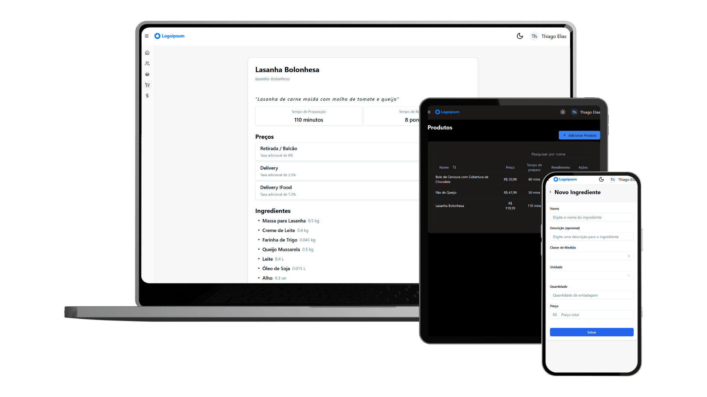
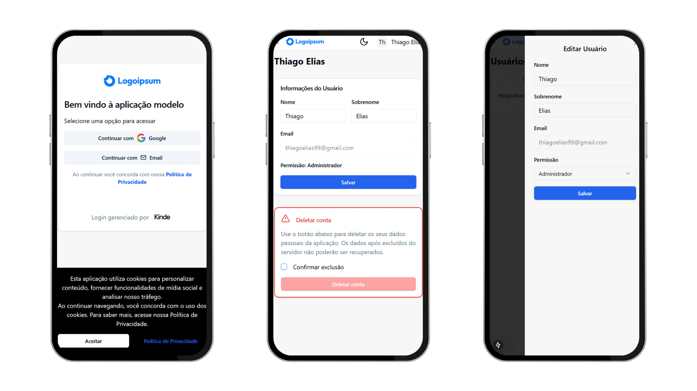
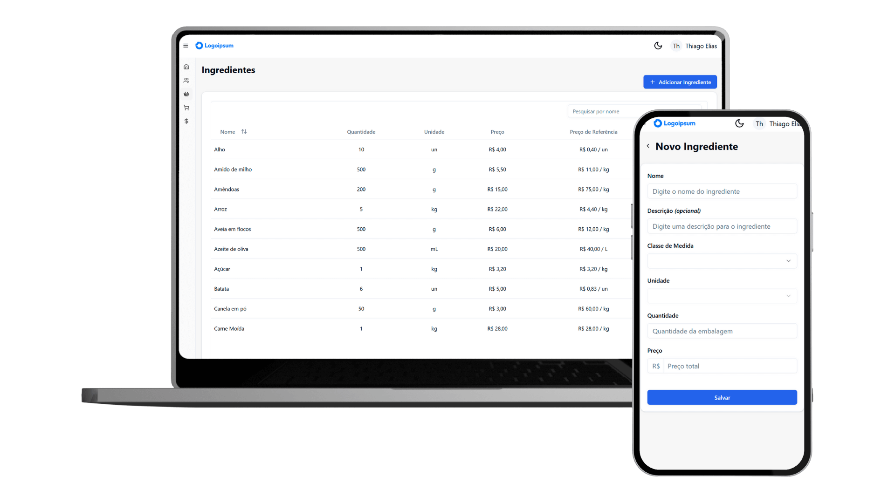
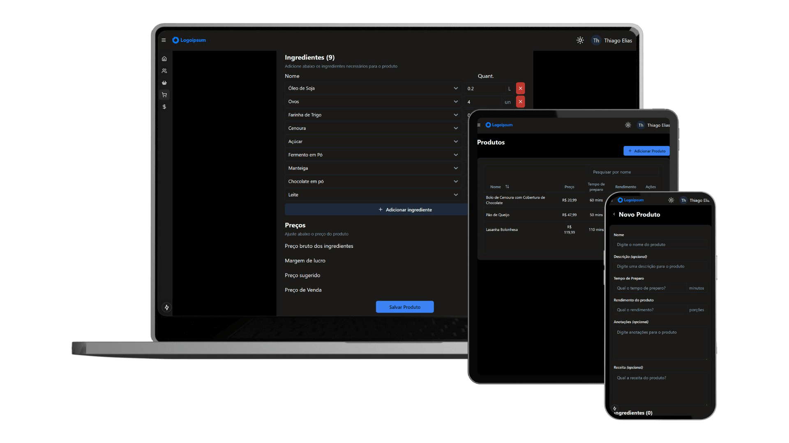
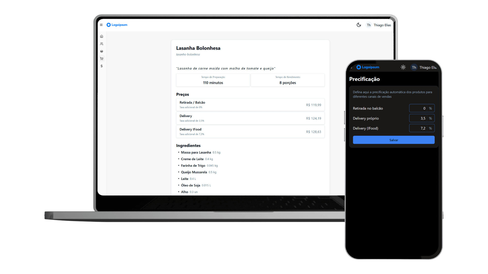

<h1 align="center">Aplicação para precificação dinâmica de produtos (MVP)</h1>

<h2 align="center">Aplicação MVP desenvolvida para um comércio de marmitas, com o objetivo de substituir uma planilha de cálculo automático de preços dos produtos</h2>
Autorizado o uso do MVP da aplicação com algumas modificações para portfólio pessoal.

## Recursos

### Autenticação e Controle de Acesso

🔹 Login via e-mail ou Google  
🔹 Gerenciamento de usuários com permissões de acesso (admin, gerente, colaborador)

### Telas de Ingredientes

🔹 Registro de ingredientes com campos como nome, preço da embalagem, unidade de medida e categoria  
🔹 Cálculo automático do custo por unidade  
🔹 Atualização automática de preços ao alterar o valor da embalagem

### Tela de Produtos

🔹 Registro de produtos com seleção de ingredientes cadastrados para composição de receitas  
🔹 Cálculo automático do custo total dos ingredientes  
🔹 Registro de tempo de preparo e rendimento da receita  
🔹 Área de anotações personalizadas (somente texto)  
🔹 Precificação em diferentes canais de venda  
🔹 Configuração da margem de lucro desejada
🔹 Visualização otimizada para impressão

### Tela de Configuração de Precificação

🔹 Registro de taxas para diferentes canais de venda  
🔹 Configuração da margem de lucro desejada

### Outros Recursos

🔹 Interface adaptável para desktop e mobile  
🔹 Modo claro e escuro para melhor usabilidade  
🔹 Conformidade com LGPD (Lei Geral de Proteção de Dados)  
🔹 Política de privacidade  
🔹 Notificação de cookies

### Galeria de Imagens

#### Login e perfil do usuário

#### Listagem e cadastro de ingredientes

#### Listagem e cadastro de produtos (modo escuro)

#### Visualização para impressão e precificação

## Instalação com Docker

🔹 Necessário o [Node.js](https://nodejs.org/pt) na versão 18+  
🔹 Necessário configurar conta no [Kinde Auth](https://kinde.com/)  
🔹 Renomear o arquivo `.env.docker.example` para `.env.docker` e configurar as variáveis de ambiente  
🔹 Executar o script automatizado `npm run docker:prod`  
🔹 Acessar a aplicação no [http://localhost:3000/app/inicio](http://localhost:3000/app/inicio)
